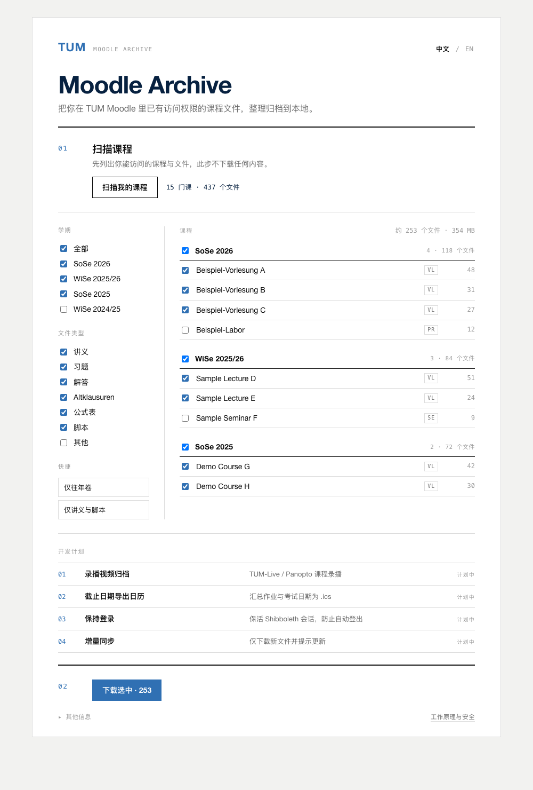

# TUM Moodle Archive

A small Chrome/Edge extension to **scan and archive your own TUM Moodle course
files** into tidy local folders — for personal Moodle archive use.

It runs inside the browser **you are already logged in to**, so it never sees your
password and never touches 2FA. It downloads only what **your own account can already
access**, to **your own computer**, and **uploads nothing**.



> ⚠️ **Not an official TUM tool.** Independent project, not affiliated with or endorsed
> by the Technical University of Munich or the Moodle project. For personal use by TUM
> staff and students only — see [Privacy & scope](#privacy--scope).

## What it does

1. **Scan** — lists every course you can access (via Moodle's own course API) and walks
   each course (including tabbed/onetopic course pages) to find all downloadable files.
   Nothing is downloaded in this step.
2. **Filter** — pick what to download by **semester**, **course**, and **file type**
   (Lectures · Exercises · Solutions · Exams · Formula_Sheets · Scripts · Others), or
   one-click **"exam materials only"** (Klausur / Altklausur / Probeklausur / Prüfung …).
3. **Download** — native browser downloads, organised as:

```
Downloads/TUM_Archive/
└── <Semester>/                e.g. SoSe_2025, WiSe_2024-2025
    └── <Course>/
        └── <Category>/        only the categories that actually have files
            └── files
```

Related Moodle entries (Praktikum / Tutorübung / Zentralübung) fold under their main
course. Student assemblies (*Vollversammlung*) are skipped by default.

**Incremental:** it remembers what it already downloaded, marks **new** files after a
re-scan, and skips files you already have. Bilingual UI (中文 / English). Scanning and
downloading both show progress and can be **stopped** or **reset** at any time.

## Install (developer mode)

Not on the Chrome Web Store yet, so load it unpacked:

1. Download this repo (green **Code → Download ZIP**, then unzip) or `git clone` it.
2. Open `chrome://extensions` (or `edge://extensions`).
3. Turn on **Developer mode** (top-right).
4. Click **Load unpacked** and select the project folder.
5. Open [moodle.tum.de](https://www.moodle.tum.de) and log in.
6. Click the extension icon → **Scan**, then pick what to download.

## Privacy & scope

This project shares **the tool, not any files**.

- ✅ Downloads only **your own** accessible courses, to **your own** disk.
- ✅ Uses your existing browser login — **no passwords, no cookies handled, no 2FA bypass**.
- ✅ **Nothing is uploaded** to any server or third party.
- 🚫 Do **not** redistribute or publish downloaded course material — it is copyrighted by
  the lecturers / TUM ("Personal and students at TUM only may copy the material for their
  personal use … distribution to other persons … is not allowed"). `.gitignore` blocks
  course files so they can't be committed by accident.
- 🚫 No scraping of other people's accounts, no permission bypass, no exam answering.

You are responsible for complying with TUM's and your courses' terms of use.

## Roadmap

Planned, not in this first version:

- [ ] Lecture-recording archive (TUM-Live / Panopto)
- [ ] Deadlines → calendar (`.ics`) export
- [ ] "Keep me logged in" (Shibboleth session keep-alive)
- [ ] Group-by-semester polish, per-course `README` summaries
- [ ] Chrome Web Store listing

## How it's built

- `manifest.json` — MV3; permissions `downloads`, `storage`, `scripting`, `tabs`; host
  access limited to `https://www.moodle.tum.de/*`.
- `src/scraper.js` — injected into a Moodle tab (real DOM + same-origin session) to list
  courses and resolve activities to `pluginfile` URLs.
- `src/sw.js` — service worker: classify, filter, and drive `chrome.downloads`.
- `src/classify.js`, `src/util.js` — categorisation and safe paths.
- `popup/` — the toolbar UI. `app/` — a full-page UI prototype.

## Author & License

Made by a student — **Yusong Cao (曹雨松)**. Code licensed under [MIT](LICENSE).
The licence covers the **code only** and grants no rights to any course material you
download with it.

---

## 中文简介

一个 Chrome 扩展:登录你自己的 TUM Moodle 后,一键**扫描 → 按学期/课程/类型筛选 → 原生下载**
课程文件,自动整理成 `学期/课程/分类` 的本地文件夹。

- 只下你自己有权限的课、只存本地、**不上传任何文件**;用浏览器现有登录,不碰密码/2FA。
- 支持增量同步(标记新文件、跳过已下载)、考试资料一键筛选、随时停止/重置、中英双语。
- **请勿公开转发下载到的课程资料**(版权归 TUM/讲师,仅限师生个人使用)。
- 安装:`chrome://extensions` → 开启开发者模式 → 「加载已解压的扩展程序」→ 选本文件夹。
- 非 TUM 官方工具,个人作品。
